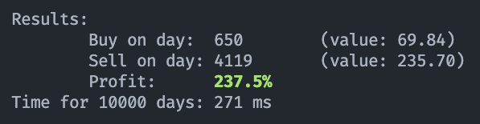

# Basic Stock Analysis

The task is simply create a number of days with a stock price, and its change in price from the previous day. Then construct an algorithm that finds the single bst day to buy and sell the stock.

## Output:

