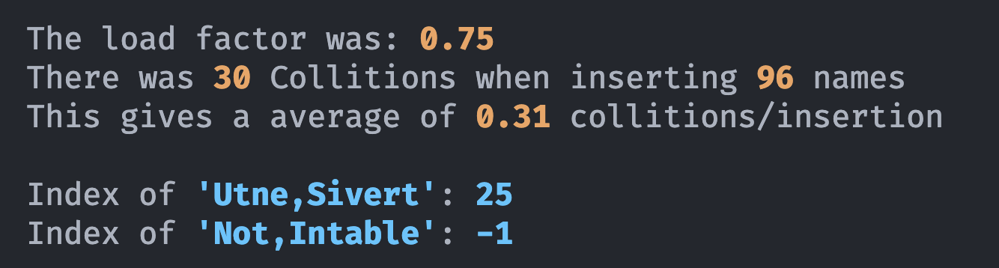
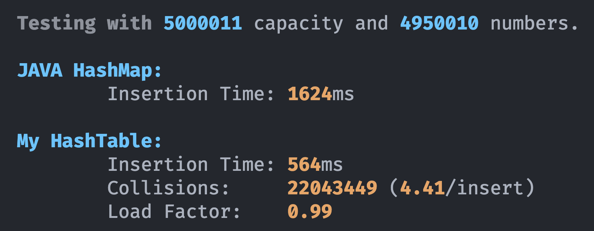

# Hash-Tables

## Output

### Task 1



Visualization of the filled Hash-Table:
```
0:      [Tolnes,Andreas]
1:      []
2:      [Gulaker,Kristian William Macdonald -> Yogalingam,Abilash]
3:      []
4:      []
5:      [Bergebakken,Tore -> Derouiche,Emir]
6:      []
7:      [Torbjørnsen,Marius]
8:      []
9:      [Evje,Kjerand]
10:     [Røstgård,Kim Richard]
11:     [Gjengedal,Helene]
12:     []
13:     []
14:     []
15:     [Jacobsen,Jonas Brager]
16:     []
17:     []
18:     []
19:     [Faksdal,Stine Olava]
20:     []
21:     []
22:     []
23:     [Eidsvaag,Mikael Nervik]
24:     [Adolfsen,Joakim Moe -> Høie,Svein Jakob]
25:     [Utne,Sivert]
26:     [Tronstad,Henrik Wanderås]
27:     [Hestmark,Bård Sørensen]
28:     [Mohammad,Mahmoud Ibrahim]
29:     [Kopperud,Pernille]
30:     []
31:     []
32:     [Brevik,Magnus -> Olsen,Mathias Årstad]
33:     []
34:     []
35:     []
36:     [Harnes,Håkon Anthonsen]
37:     []
38:     [Blichfeldt,Victoria -> Sundfær,Torstein Holmberget]
39:     [Østmo-Sæter,Lars Olsnes]
40:     [Pickel,Pascal]
41:     [Andersson,Vegard]
42:     []
43:     [Imran,Zaim Ul-Abrar]
44:     [Hollum,Jørgen -> Mcculloch,Maria Kleppestø]
45:     [Nilsen,Martin Johannes]
46:     []
47:     [Heggelund,Mathias Oppedal]
48:     [Granli,Hans Kristian Olsen]
49:     [Baugerud,Magnus -> Mahmood,Dilawar -> Trømborg,Steffen]
50:     [Bjerke,Thomas]
...
```

### Task 2

