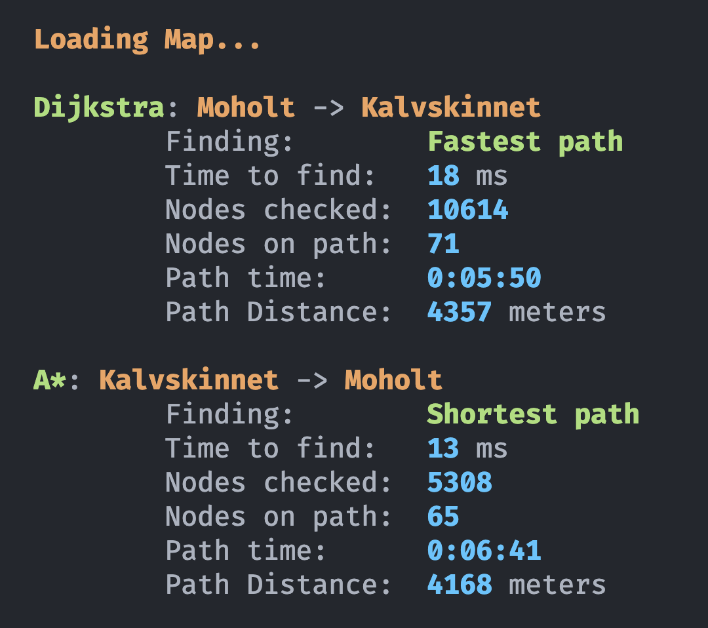
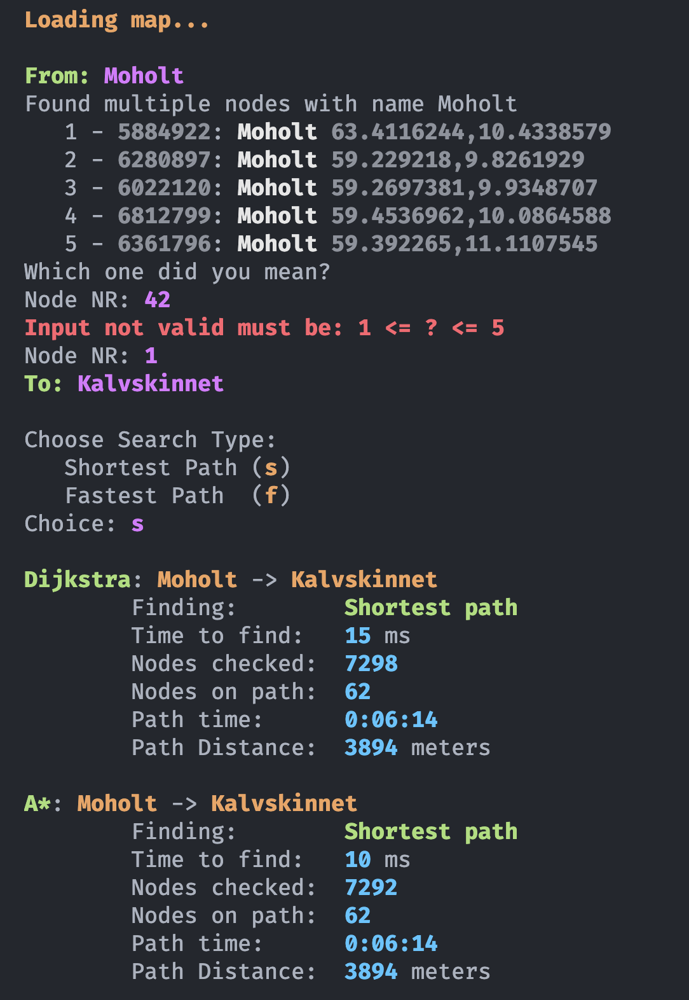
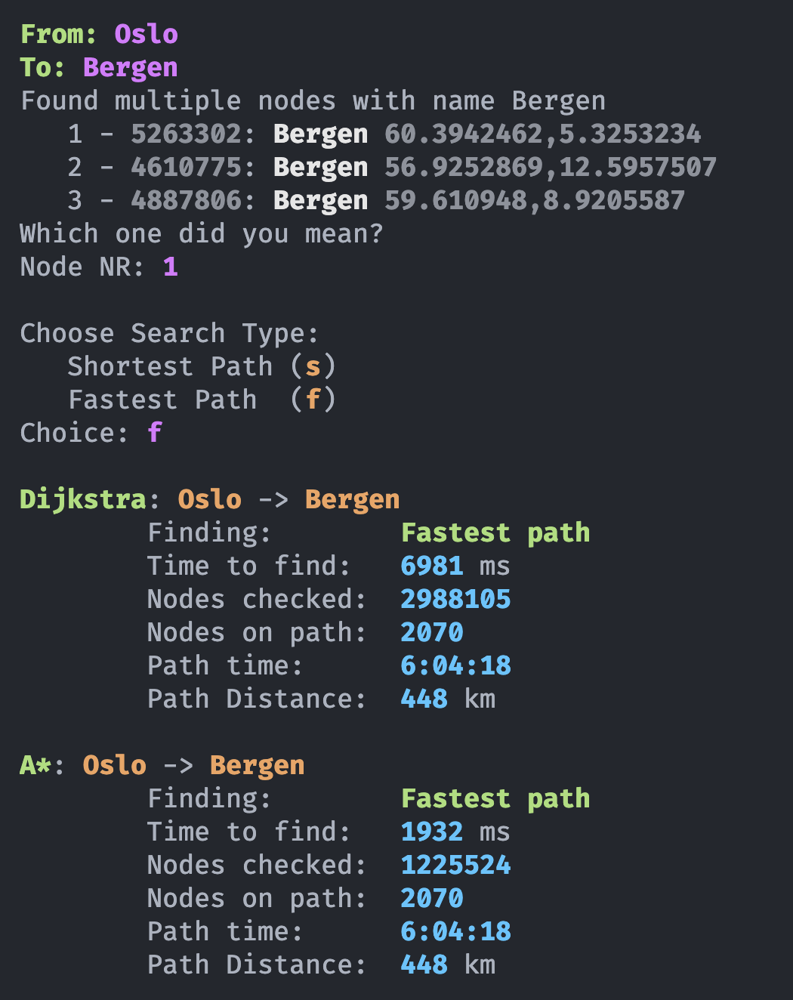
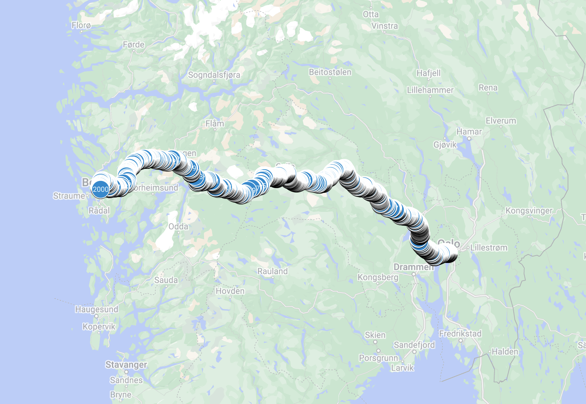
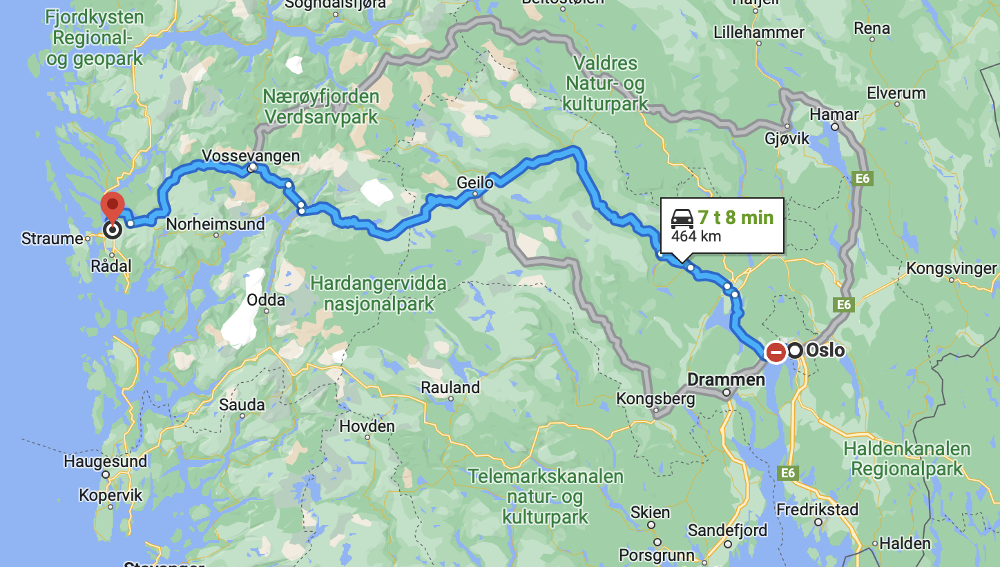

# A\* Search Algorithm on Real World Map Data

The data is represented in separate `.txt` files, one for nodes, one for edges, and one for points of interest (names). These files are very large, so they must be compressed in order to be pushed to git, simply unzip them before running the program. 

## Testing

To test and see how the program works run the `Test.java` file. The output should be the following:

## Main

As an extra feature, i added the possibility to use the search algorithms on arbitrary nodes, searchable by name. The program handles user input and errors as well. 

Run the 'Main.java' file to try this program. The output should be the following:

## Map

When paths are found, in addition to printing the information to the console as shown above, a CSV file is created in the `data/routes` directory. To view the paths in Google Maps you can use the following link: [Google Maps](https://www.google.com/maps/d/u/0/) and upload the CSV file directly to see the coordinates of all the nodes along the path (Each map layer is limited to 2000 nodes).

The result should be something like this (result from the main program out shown above):

This path can easily be compared to Googles own suggested path:

As we can see the path is very similar, although the time and distance is slightly different. This is because the data from the `.txt` files are most likely outdated, and google uses more fancy timing than simply using the speed limit the entire way.

All paths are calculated with both Dijkstra and A\*, which makes it easy to see that they both find the same exact path, but A* checks far fewer nodes, and hence is faster in most cases.