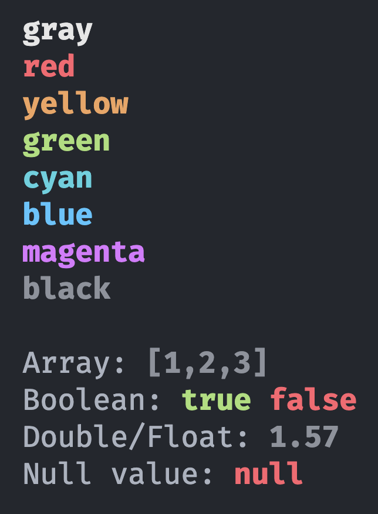

# Utils

These are some small methods that i use several times in this course. I have created:

## Printer

Ease of use methods for printing in different colours to the console. Very helpful to declutter the console and put emphasis on the important parts. Also handles formatting of printing arrays and doubles.

## Queue

Basic Queue implementation used in several assignments.

## Program

Couple methods for easy handling of Thread.sleep and closing resources.
